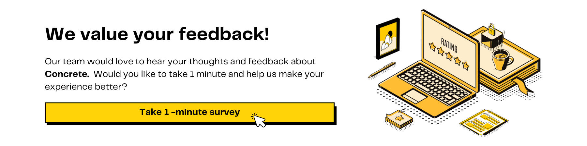

# Welcome to Concrete

⭐️[ Star the repo on Github](https://github.com/zama-ai/concrete) | 📚 [FHE resources by Zama](https://github.com/zama-ai/awesome-zama/tree/main) | 💬 [Community support ](https://community.zama.ai/)

<figure><figcaption></figcaption></figure>

**Concrete** is an open-source FHE Compiler that simplifies the use of Fully Homomorphic Encryption (FHE).

### Start here

Learn the basics of Concrete, set it up, and make it run with ease.

<table data-view="cards"><thead><tr><th align="center"></th><th data-hidden data-card-target data-type="content-ref"></th></tr></thead><tbody><tr><td align="center">What is Concrete</td><td><a href="getting-started/">getting-started</a></td></tr><tr><td align="center">Installation</td><td><a href="getting-started/installing.md">installing.md</a></td></tr><tr><td align="center">Quick start</td><td><a href="getting-started/quick_start.md">quick_start.md</a></td></tr><tr><td align="center">Basic of FHE programs</td><td><a href="getting-started/fhe_basics.md">fhe_basics.md</a></td></tr><tr><td align="center">Compatibility</td><td><a href="getting-started/compatibility.md">compatibility.md</a></td></tr><tr><td align="center">Terminology and structure</td><td><a href="getting-started/terminology_and_structure.md">terminology_and_structure.md</a></td></tr></tbody></table>

### Build with Concrete

Start building with Concrete by exploring its core features, following deployment guides, and diving into user-friendly tutorials step by step.

<table data-view="cards"><thead><tr><th align="center"></th><th></th><th></th><th data-hidden data-card-cover data-type="files"></th><th data-hidden data-card-target data-type="content-ref"></th></tr></thead><tbody><tr><td align="center"><strong>Fundamentals</strong></td><td>Explore core features of Concrete with code examples.</td><td><ul><li><a href="fundamentals/decorator.md">Decorator</a></li><li><a href="fundamentals/progressbar.md">Progressbar</a></li><li><a href="fundamentals/formatting.md">Formatting</a></li><li><a href="fundamentals/tagging.md">Tagging</a></li></ul></td><td><a href=".gitbook/assets/3.png">3.png</a></td><td><a href="broken-reference/">broken-reference</a></td></tr><tr><td align="center"><strong>Guides</strong></td><td>Discover essential deployment guides to streamline your projects.</td><td><ul><li><a href="guides/configure.md">Configure</a></li><li><a href="guides/manage_keys.md">Manage keys</a></li><li><a href="guides/deploy.md">Deploy</a></li><li><a href="guides/debug.md">Debug</a></li></ul></td><td><a href=".gitbook/assets/2.png">2.png</a></td><td><a href="broken-reference/">broken-reference</a></td></tr><tr><td align="center"><strong>Tutorials</strong></td><td>Follow step-by-step guides to build use case examples with Concrete.</td><td><ul><li><a href="tutorials/see-all-tutorials.md#start-here">Start here</a></li><li><a href="tutorials/see-all-tutorials.md#go-further">Go further</a></li></ul></td><td><a href=".gitbook/assets/1.png">1.png</a></td><td><a href="broken-reference/">broken-reference</a></td></tr></tbody></table>

### Explanations

Review product architecture, and access additional resources for in-depth explanations while working with Concrete.

<table data-view="cards"><thead><tr><th align="center"></th><th data-hidden data-card-target data-type="content-ref"></th></tr></thead><tbody><tr><td align="center">Frontend fusing</td><td><a href="dev/fusing.md">fusing.md</a></td></tr><tr><td align="center">Compiler backend</td><td><a href="explanations/backends/">backends</a></td></tr><tr><td align="center">Project layout</td><td><a href="explanations/layout.md">layout.md</a></td></tr></tbody></table>

### Support

Our team of experts usually answers within 24 hours in working days.

<table data-card-size="large" data-view="cards"><thead><tr><th align="center"></th><th></th><th data-hidden data-card-target data-type="content-ref"></th></tr></thead><tbody><tr><td align="center">💬 <strong>Community Forum</strong></td><td>Raise your technical problems and find solutions to common issues</td><td><a href="https://community.zama.ai/">https://community.zama.ai/</a></td></tr><tr><td align="center">👾 <strong>Discord Channel</strong></td><td>Discuss FHE-related topics with our research team and the community on live</td><td><a href="https://discord.com/invite/fhe-org">https://discord.com/invite/fhe-org</a></td></tr></tbody></table>

### Developers

* [Contribute to Concrete](dev/contributing.md)
* [Latest release note](https://github.com/zama-ai/concrete/releases)
* [Feature request](https://github.com/zama-ai/concrete/issues/new?assignees=\&labels=feature\&projects=\&template=features.md)
* [Bug report](https://github.com/zama-ai/concrete/issues/new?assignees=\&labels=bug%2C+triage\&projects=\&template=bug\_report.md)

***

<figure><picture><source srcset=".gitbook/assets/feedback_banner_dark.png" media="(prefers-color-scheme: dark)"></picture><figcaption></figcaption></figure>
